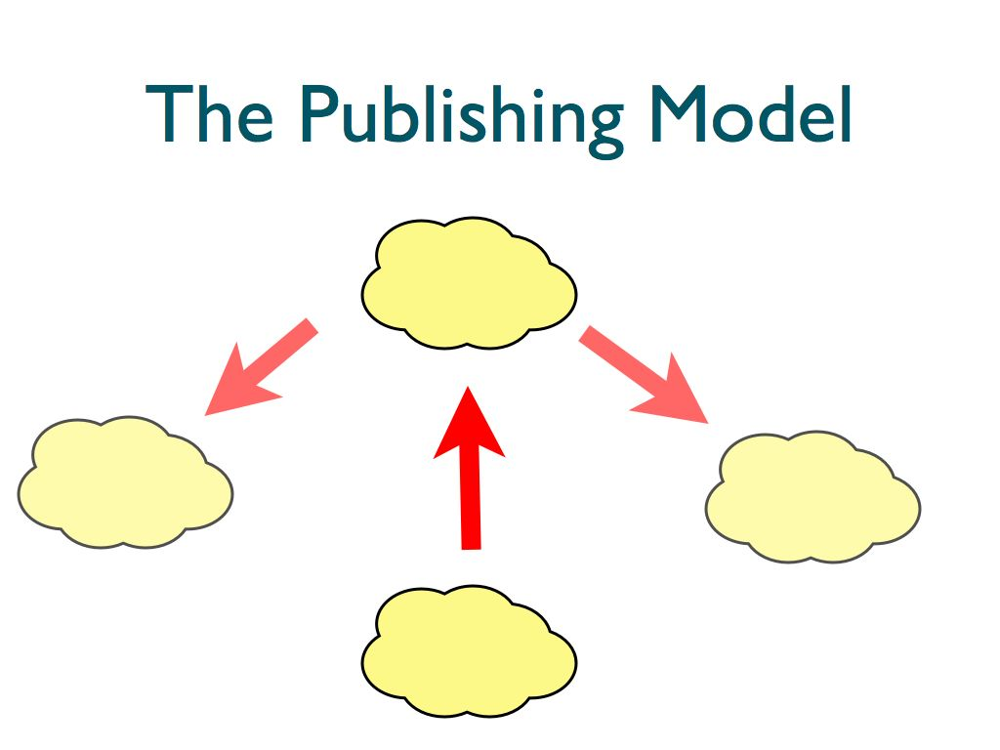
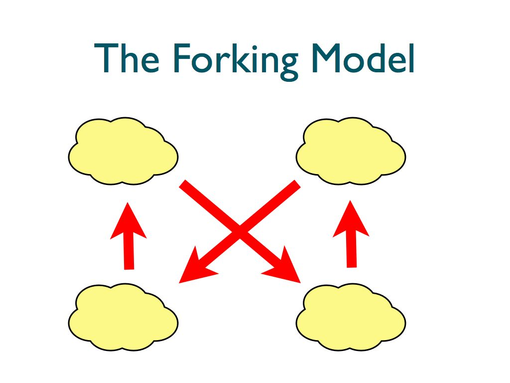
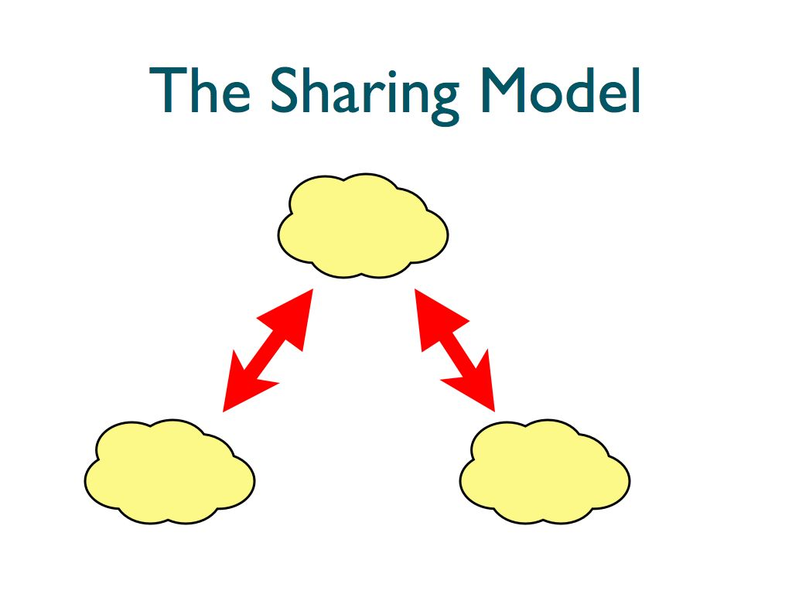

# Session 3 Notes

## Twitter bootstrap

Last time we looked at how you can use CSS to change the appearance of your site. Making things look good with CSS is a bit of an art, which is only really acquired over time (or not, in my case!). Thankfully there are pre-existing solutions out there to make your life easier.

[Twitter bootstrap](http://twitter.github.com/bootstrap/) is set of CSS (& Javascript) files, released by the makers of twitter. It makes a lot easier to produce websites that won't make you want to sick up into your mouth everytime you look at them. We'll now look at adding twitter bootstrap to your `first_site/index.html` page (you should have renamed your page to this as part of the homework).

To start with go to the [twitter bootstrap](http://twitter.github.com/bootstrap) website (notice that it's hosted at github, like ours is!) and click the download button. When you've downloaded and unzipped the file, copy the `bootstrap` folder into your `first_site` folder.

When we covered CSS last time I mentioned that there are a few different ways of including it in your webpage. We did it by putting the css inside a `<style>..</style>` tags in the `<head>` of your page. This time we're going to do it by linking to a separate css file. This is more efficient, as it means that when someone's browsing your site they don't have to download the css file for each new page. In the head section of your `first_site/index.html` put the following line:

    <link href='bootstrap/css/bootstrap.css' rel='stylesheet'>

You can also remove the `<style>..</style>` tags and delete your css from last time if you want.

When you go to your browser and press refresh, things should look slightly better - bootstrap chooses slightly nicer fonts than the browser does by default. To get the full effects of bootstrap we need to tweak our html.

First thing we're going to do is centre our content on the page. To find out how, we'll look at the bootstrap documentation: go to the bootstrap website, and click on the `Scaffolding` tab. Then navigate to the [Layouts section](http://twitter.github.com/bootstrap/scaffolding.html#layouts). We're going to do a fixed width layout. The docs tell us that we need to have a `<div class="container"> .. </div>` surrounding the bit we want centered, and give an example of where to put this:

    <body>
      <div class="container">
        ...
      </div>
    </body>

Go to your file, and put a `<div class="container">` immediately after the `<body>` tag, and a `</div>` immediately before the `</body>` tag. When you save the file, and refresh the page in your browser you should see the content in the center of your page.

This workflow is pretty common:
1. find something you want to change
2. have a look in the bootsrap docs
3. make the suggested change and see how it looks.
    
We'll now do the same thing to make the table look nicer. Check out `Base CSS > Tables` on the boostrap site. It asks you to change your `<table>` tag so it looks like:

```
<table class="table">
```

If you do this, save, and refresh, your table should look a lot nicer. You should spend a bit of time checking out the bootstrap site, and see if you can make the rest of your site look a bit better!

Note: in css the last rule wins (all else being equal - generally more specific rules will win e.g. `div#title` beats `div`). If you link to another stylesheet _after_ twitter bootstrap (or put in `<style>..</style>` tags) then these will be applied on top of the bootstrap files. If you put the link or tags in _before_ they will probably be overridden by bootstrap.

## Collaboration: Publishing model

Last time we looked at pushing your code up to github. Push up the changes you've just made to your site:

    cd first_site
    git add .
    git commit -m "Added twitter bootstrap"
    git push

You can think of this code as being published on github for others to read. This brings us to our first way of collaborating with others:



In the publishing model one person pushes their work to github, and others pull it down and use it. To do this in practice you need to use the `git clone` command:

    cd coding_course
    git clone git://github.com/TomClose/first_site.git toms_site

You should now see a new file called `toms_site` in your `coding_course` folder, and be able to open `toms_site/index.html` in your browser. The clone operation has copied a local version of the repository onto your computer.

Git will help you keep this local copy updated. If I've made some changes and pushed them up to github, you just need to run

    git pull

to pull them down onto your laptop.

## Conflicts

The version on your laptop is stored in a fully functional git repository: you can make changes to the site and commit it if you want. What happens if we both make changes at the same time?

Open `toms_site/index.html` in your code editor, and change the page heading (inside `<h1>`) to something of your choosing. (At the same time I'll also make a change). When you're done, commit your change to the local repository:

    git add .
    git commit -m "Changed heading"

I'll push my change up and you pull it down:

    git pull

You should now have a message telling you that you have a merge conflict. This is because our two changes have been made at the same time, so git is unabled to work out which is the up-to-date one to keep. If you look in your file you should see things that look like


To fix the merge conflict you need to edit this by hand, picking the version you want and then do:

    git add .
    git commit -m "Fixed conflicts"

## Collaboration: Forking model

You're now able to get someone else's code. What about sharing your changes with them. Try doing:

    git push

You'll find that you can't push to my repository.

One of the options for sharing your changes with me, is for you to publish your repository too. I can then pull your changes down just as you pulled mine.



Notice that this situation is symmetric - my repositories are equivalent to yours. This makes it a suitable model for many open source projects, where the project maintainer might change over time.

Github makes this model easy by providing a 'forking' button. Go to [github.com/TomClose/landing_page](github.com/TomClose/landing_page) and press the 'Fork' button. You now have a copy of my repository that you can push to if you want to. If you want do send me some changes you can do this by going back to [github.com/TomClose/landing_page](github.com/TomClose/landing_page) and submitting a 'pull request'.

## Coallaboration: Sharing model

The other way or collaborating with git is the 'sharing' model: one person puts the repository on github and gives other people permissions, so you can all push to the same place.



To do this on github, go to your forked landing page repository and click on 'Settings' on the right hand side. Then go to 'Collaborators' and add your team members' github usernames. 

<div class='new' markdown="1">

## For next time


</div>

